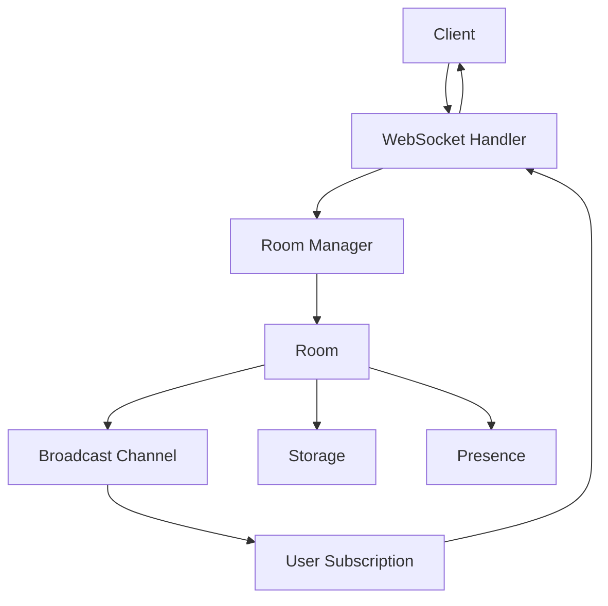

# ws-rooms

An attempt to replicate the infrastructure of `liveblocks` (https://liveblocks.io/docs/platform/websocket-infrastructure). Liveblocks provides a brilliant
infrastructure for creating collaborative applications in the same vein as Figma, or Google Docs. [Rayon](https://www.rayon.design/) is a useful example of a application which
has folded Liveblocks deep within its stack.

<p align="center">
  <a href="https://liveblocks.io#gh-light-mode-only">
    
  </a>
  <a href="https://liveblocks.io#gh-dark-mode-only">
    
  </a>
</p>

I'd been building a 'figma-esque' application where I'd wrapped a bevy application in a react application. I'd setup bidrectional communication between the 
rust and typescript 'worlds', but ultimately wanted to interact with the livelocks server form both the rust and typescript side. There is so far only a typescript
client. I considered using Livekit, but then thought it prudent to 'build it to understand it', so built my own liveblocks server implementation, but in rust.

## Liveblocks Overview

Liveblocks provides a real-time WebSocket room management system with support for collaborative editing, presence tracking, and shared storage. Clients within a room broadcast via websocket message
their `presence`, which is generally lightweight ephemeral data, such as cursor position. Client can update the central room `storage` via an http post request to the server. The server then informs
connected clients that the storage has been updated, leaving it to the clients to determine when to fetch the updated data. The update can usually be given via a http patch or diff. Liveblocks represents
its storage using conflict free replicated date types (CRDTs) in order to gracefully manage offline/online conflict reconciliation, and these data types can provide diffs between a previous and the current state,
so a user does not have to refetch the entire storage again.

We've replicated most of liveblocks's websocket server architecture, but still need to utilise CRDTs.


## 🚀 Features

- **Real-time Room Management** - Create, join, and manage multiple rooms dynamically
- **Presence Tracking** - Live presence updates for connected clients
- **Collaborative Storage** - CRDT-based shared document storage using Yrs (Y.js compatible)
- **WebSocket Communication** - Robust bi-directional messaging with heartbeat monitoring
- **REST API** - Complete HTTP API for room and storage management
- **Auto-scaling** - Automatic room cleanup and resource management
- **Production Ready** - Docker containerization with Fly.io deployment support

## 🏗️ Architecture

The system follows a broadcast-based messaging architecture:



### Core Components

- **Room Manager**: Central coordinator for room creation and client management
- **WebSocket Handler**: Manages individual client connections with concurrent tasks
- **Broadcast Channels**: Efficient message distribution to room participants
- **Storage System**: CRDT-based collaborative document storage
- **Presence System**: Real-time tracking of client states and activities

## 📋 Prerequisites

- Rust 1.70+ (uses 2024 edition)
- Cargo
- Docker (for containerized deployment)

## 🛠️ Installation

### Clone and Build

```bash
git clone <repository-url>
cd ws-rooms
cargo build --release
```

### Run Server

```bash
cargo run --bin server
```

The server will start on `http://0.0.0.0:8080` by default.

### Run Test Client

```bash
cargo run --bin client [room_id]
```

If no room_id is provided, it defaults to "default_room".

## 📡 API Reference

### WebSocket Endpoints

#### Connect to Room
```
ws://localhost:8080/ws/room/{room_id}
```

### REST API Endpoints

#### Room Management
- `GET /api/rooms` - List all rooms
- `GET /api/rooms/{room_id}` - Get room details
- `POST /api/rooms/{room_id}` - Create room
- `DELETE /api/rooms/{room_id}` - Delete room

#### Storage Management
- `GET /api/rooms/{room_id}/storage` - Get room storage
- `POST /api/rooms/{room_id}/storage` - Initialize storage
- `DELETE /api/rooms/{room_id}/storage` - Delete storage

#### Presence Management
- `GET /api/rooms/{room_id}/presence` - Get room presence

## 🔄 Message Types

### Client Messages
```rust
enum ClientMessageType {
    UpdatePresence(Presence::Update),
    UpdateStorage(Storage::Operation),
    JoinRoom(RoomId),
    LeaveRoom,
    Pong,
}
```

### Server Messages
```rust
enum ServerMessageType {
    RoomJoined { room_id, client_id },
    RoomLeft { room_id, client_id },
    PresenceUpdated { client_id, timestamp, presence },
    StorageUpdated { version, operations },
    Ping,
}
```

## 💻 Usage Examples

### Basic WebSocket Client (JavaScript)

```javascript
const ws = new WebSocket('ws://localhost:8080/ws/room/my-room');

ws.onopen = () => {
    console.log('Connected to room');
    
    // Send presence update
    ws.send(JSON.stringify({
        UpdatePresence: {
            // presence data
        }
    }));
};

ws.onmessage = (event) => {
    const message = JSON.parse(event.data);
    console.log('Received:', message);
};
```

### REST API Usage

```bash
# Create a room
curl -X POST http://localhost:8080/api/rooms/my-room

# Get room info
curl http://localhost:8080/api/rooms/my-room

# Initialize storage
curl -X POST http://localhost:8080/api/rooms/my-room/storage

# Get presence
curl http://localhost:8080/api/rooms/my-room/presence
```

## 🏃‍♂️ Development

### Project Structure

```
src/
├── api/              # REST API endpoints
│   ├── rooms/        # Room management API
│   ├── storage/      # Storage API
│   └── presence/     # Presence API
├── bin/              # Binary executables
│   ├── server.rs     # Main server binary
│   └── client.rs     # Test client binary
├── room/             # Core room logic
│   ├── manager.rs    # Room coordination
│   ├── presence/     # Presence tracking
│   └── storage/      # Document storage
├── ws/               # WebSocket handling
│   ├── mod.rs        # WebSocket handler
│   └── fsm.rs        # Connection state machine
├── server.rs         # Server application
└── lib.rs            # Library exports
```

### Key Dependencies

- **axum**: Async web framework with WebSocket support
- **tokio**: Async runtime with full features
- **serde**: Serialization framework
- **yrs**: Y.js compatible CRDT implementation
- **uuid**: Client ID generation
- **tracing**: Logging and instrumentation

### Running Tests

```bash
cargo test
```

### Development Server

```bash
# Run with debug logging
RUST_LOG=debug cargo run --bin server
```

## 🐳 Docker Deployment

### Build Image

```bash
docker build -t ws-rooms .
```

### Run Container

```bash
docker run -p 8080:8080 ws-rooms
```

## ☁️ Fly.io Deployment

This project is configured for Fly.io deployment:

```bash
# Deploy to Fly.io
fly deploy

# View logs
fly logs
```

The application is configured to:
- Auto-scale based on demand
- Run in the CDG (Paris) region
- Use 1GB memory with shared CPU
- Force HTTPS connections

## ⚙️ Configuration

### Environment Variables

- `PORT`: Server port (default: 8080)

### Heartbeat Settings

- **Server Ping Interval**: 30 seconds
- **Client Timeout**: 60 seconds
- **Cleanup Interval**: 30 seconds

## 🔧 Customization

The system is built with generics to support different room types, client IDs, presence models, and storage implementations:

```rust
pub type PresentationManager = RoomsManager<RoomId, ClientId, PresentationPresence, SharedPresentation>;
```

You can customize by implementing the required traits:
- `RoomIdLike`
- `ClientIdLike` 
- `PresenceLike`
- `StorageLike`

## 🤝 Contributing

1. Fork the repository
2. Create a feature branch
3. Make your changes
4. Add tests if applicable
5. Submit a pull request

## 📝 License

[Add your license information here]

## 🐛 Troubleshooting

### Common Issues

**Connection Timeouts**
- Check firewall settings
- Verify WebSocket upgrade headers
- Ensure proper CORS configuration

**Room Not Found**
- Rooms are created automatically on first join
- Check room ID format and encoding

**Message Serialization Errors**
- Verify JSON format matches expected message types
- Check for required fields in message payloads

### Debug Mode

Run with debug logging to see detailed connection and message information:

```bash
RUST_LOG=debug cargo run --bin server
``` 
