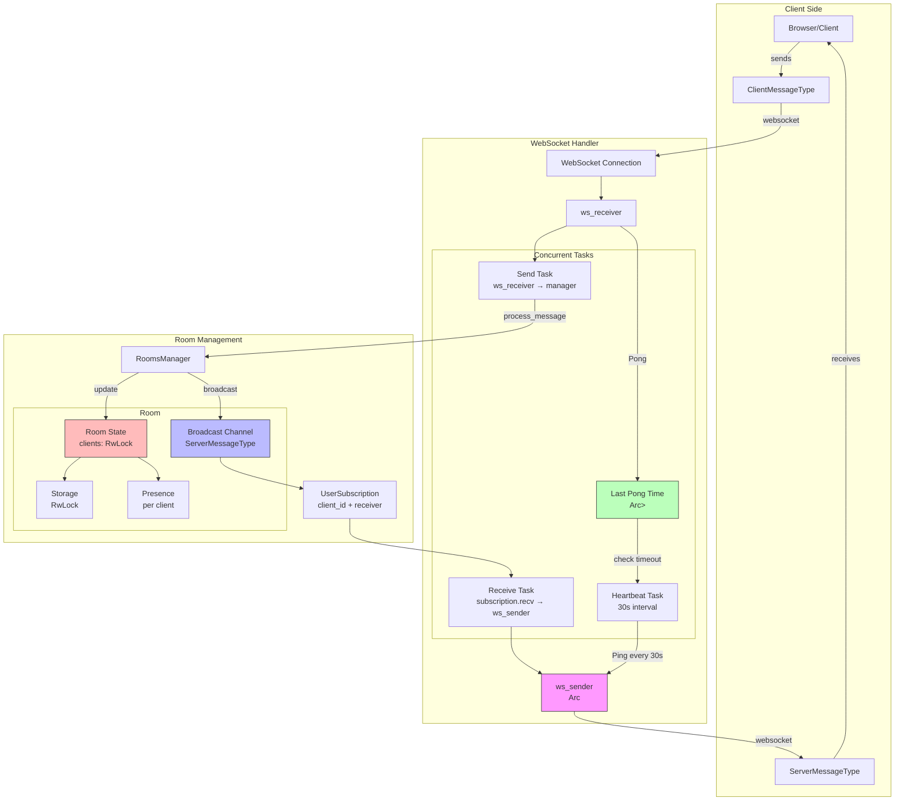

# WebSocket-Based Room Management System Architecture

## Overview
Our system implements a real-time room management solution using WebSocket connections, with support for presence tracking and persistent storage. The architecture follows a broadcast-based pattern where messages flow bidirectionally between clients and the server through dedicated channels.

## Message Types
We have two primary message types that flow through the system:

```rust
#[derive(Debug, Serialize, Deserialize)]
pub enum ClientMessageType {
    UpdatePresence(Presence::Update),
    UpdateStorage(Storage::Operation),
    JoinRoom(RoomId),
    LeaveRoom,
    Pong,
}

#[derive(Debug, Serialize, Deserialize)]
pub enum ServerMessageType<RoomId, ClientId, P, S> {
    RoomJoined {
        room_id: RoomId,
        client_id: ClientId,
    },
    RoomLeft {
        room_id: RoomId,
        client_id: ClientId,
    },
    PresenceUpdated {
        client_id: ClientId,
        timestamp: DateTime<Utc>,
        presence: P,
    },
    StorageUpdated {
        version: u64,
        operations: Vec<S::Operation>,
    },
    Ping,
}
```

## Core Components

### 1. Room Manager
The `RoomsManager` is the central coordinator that handles room creation, client management, and message distribution:

```rust
pub struct RoomsManager {
    rooms: RwLock<HashMap<RoomId, Arc<Room>>>,
}

impl RoomsManager {
    pub async fn ensure_room(&self, room_id: RoomId) -> Arc<Room> {
        let rooms = self.rooms.read().await;
        if let Some(room) = rooms.get(&room_id) {
            room.clone()
        } else {
            drop(rooms);
            let mut rooms = self.rooms.write().await;
            let room = Arc::new(Room::new(room_id));
            rooms.insert(room_id, room.clone());
            room
        }
    }
}
```

### 2. Room State
Each room maintains its own state, including connected clients and a broadcast channel:

```rust
pub struct Room {
    room_id: RoomId,
    clients: RwLock<HashMap<ClientId, ClientState>>,
    sender: broadcast::Sender<ServerMessageType>,
    storage: RwLock<Box<dyn StorageLike>>,
}

pub struct ClientState {
    forwarder: ClientForwarder,
    presence: Box<dyn PresenceLike>,
    last_seen: DateTime<Utc>,
    connection_info: ConnectionInfo,
    permissions: ClientPermissions,
}
```

### 3. WebSocket Handler
The WebSocket handler manages individual client connections through three concurrent tasks:

```rust
pub async fn handle_websocket_connection(
    socket: WebSocket,
    rooms_manager: Arc<RoomsManager>,
    client_id: ClientId,
) {
    let (ws_sender, ws_receiver) = socket.split();
    let last_pong = Arc::new(Mutex::new(Instant::now()));
    
    // Spawn concurrent tasks
    let receive_task = tokio::spawn(handle_receive_messages(/* ... */));
    let send_task = tokio::spawn(handle_send_messages(/* ... */));
    let heartbeat_task = tokio::spawn(handle_heartbeat(/* ... */));

    // Wait for any task to complete (or fail)
    tokio::select! {
        _ = receive_task => {},
        _ = send_task => {},
        _ = heartbeat_task => {},
    }
}
```

### 4. Message Broadcasting
Messages are broadcast to all clients in a room using Tokio's broadcast channel:

```rust
impl Room {
    pub async fn broadcast_message(&self, message: ServerMessageType) {
        // Broadcast returns Err only if there are no receivers
        let _ = self.sender.send(message);
    }

    pub async fn process_client_message(
        &self,
        client_id: ClientId,
        message: ClientMessageType,
    ) -> Result<(), RoomError> {
        match message {
            ClientMessageType::UpdatePresence(update) => {
                let mut clients = self.clients.write().await;
                if let Some(client) = clients.get_mut(&client_id) {
                    client.presence_mut().apply_update(update).await?;
                    
                    self.broadcast_message(ServerMessageType::PresenceUpdated {
                        client_id,
                        timestamp: Utc::now(),
                        presence: client.presence().clone(),
                    }).await;
                }
            },
            // Handle other message types...
        }
        Ok(())
    }
}
```

### 5. Client Subscription
Each client maintains a subscription to receive messages from the room:

```rust
pub struct UserSubscription {
    client_id: ClientId,
    receiver: broadcast::Receiver<ServerMessageType>,
}

impl UserSubscription {
    pub async fn receive_messages(&mut self) -> Result<ServerMessageType, BroadcastError> {
        self.receiver.recv().await
    }
}
```

## Message Flow Examples

### 1. Client Updating Presence
```rust
// Client sends:
let client_message = ClientMessageType::UpdatePresence(PresenceUpdate {
    cursor_position: Some(Point { x: 100, y: 200 }),
    status: UserStatus::Active,
});

// Server processes and broadcasts:
let server_message = ServerMessageType::PresenceUpdated {
    client_id: client_id,
    timestamp: Utc::now(),
    presence: updated_presence,
};
```

### 2. Storage Operations
```rust
// Client sends storage operation:
let client_message = ClientMessageType::UpdateStorage(
    StorageOperation::Insert { key: "key1", value: "value1" }
);

// Server broadcasts after applying:
let server_message = ServerMessageType::StorageUpdated {
    version: new_version,
    operations: vec![applied_operation],
};
```

## Heartbeat Mechanism
The heartbeat system ensures connection health:

```rust
async fn handle_heartbeat(
    ws_sender: Arc<Mutex<SplitSink<WebSocket, Message>>>,
    last_pong: Arc<Mutex<Instant>>,
) {
    let mut interval = tokio::time::interval(Duration::from_secs(30));
    loop {
        interval.tick().await;
        
        // Check last pong time
        let last_pong_time = *last_pong.lock().await;
        if last_pong_time.elapsed() > Duration::from_secs(120) {
            break; // Connection considered dead
        }
        
        // Send ping
        let sender = ws_sender.lock().await;
        if sender.send(Message::Ping(vec![])).await.is_err() {
            break;
        }
    }
}
```

## Error Handling
The system implements comprehensive error handling:

```rust
#[derive(Debug, Error)]
pub enum RoomError {
    #[error("Client not found")]
    ClientNotFound,
    #[error("Storage error: {0}")]
    StorageError(#[from] StorageError),
    #[error("Presence error: {0}")]
    PresenceError(#[from] PresenceError),
    #[error("Broadcast error: {0}")]
    BroadcastError(#[from] broadcast::error::SendError<ServerMessageType>),
}
```

This architecture provides a robust foundation for real-time collaboration, with clear separation of concerns and efficient message handling. The system is designed to be scalable and maintainable, with each component having well-defined responsibilities and communication patterns.

Would you like me to elaborate on any particular aspect of the architecture or provide more specific code examples for any component?
